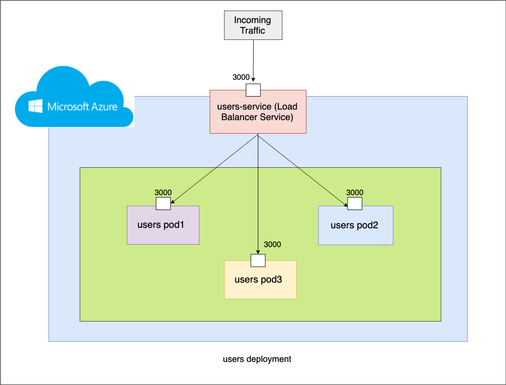
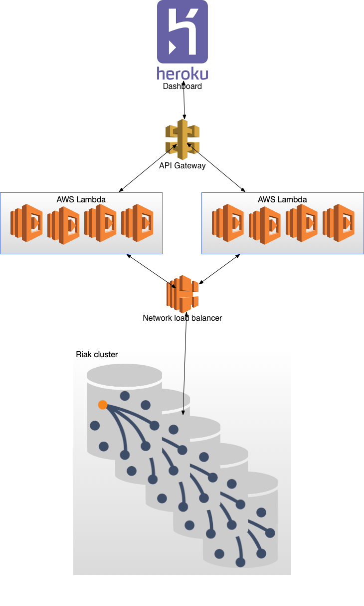
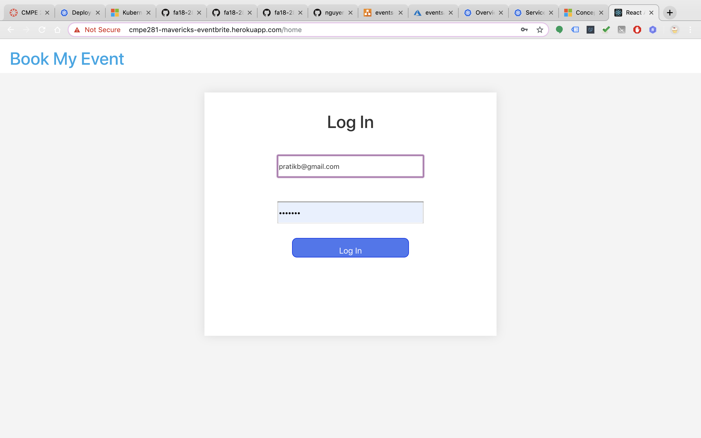
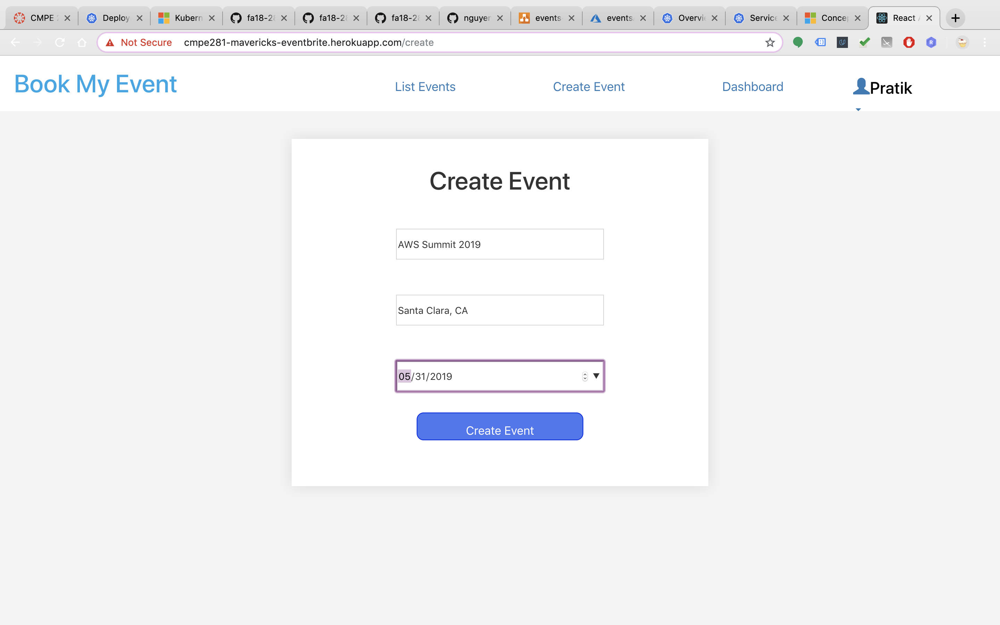
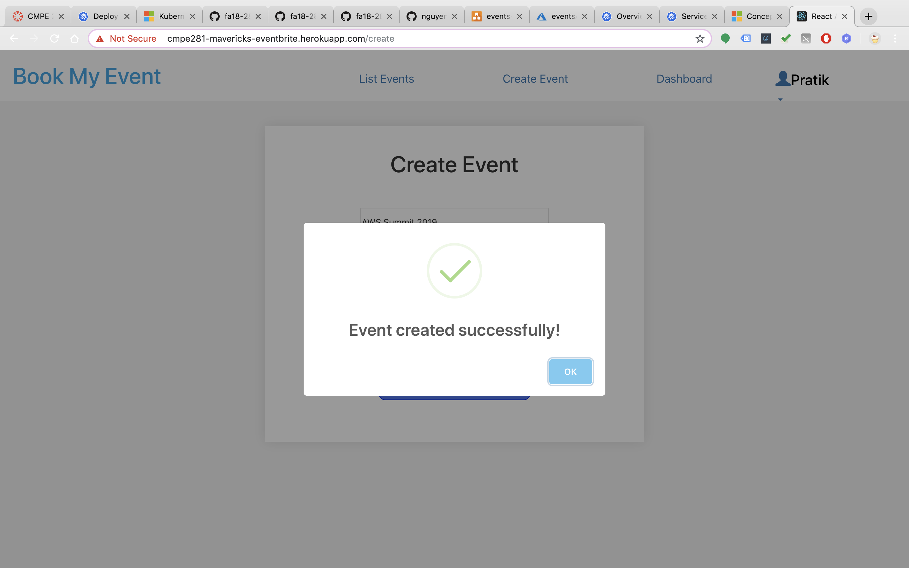
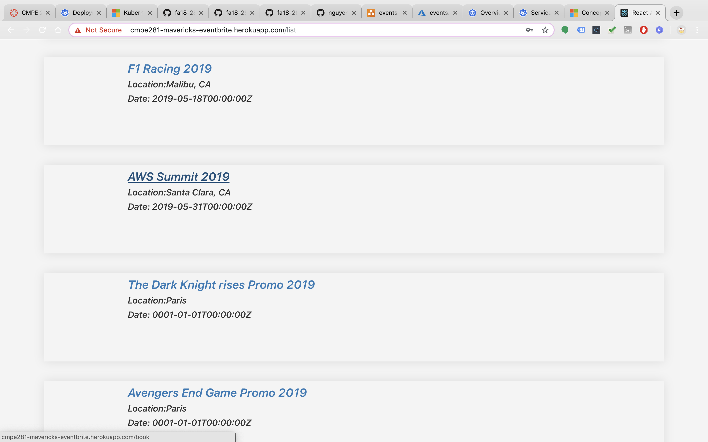
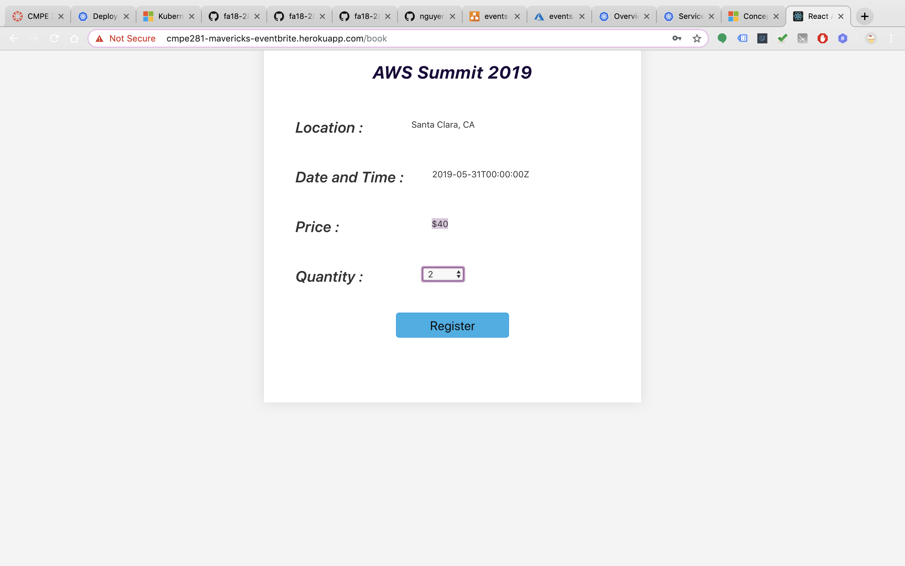
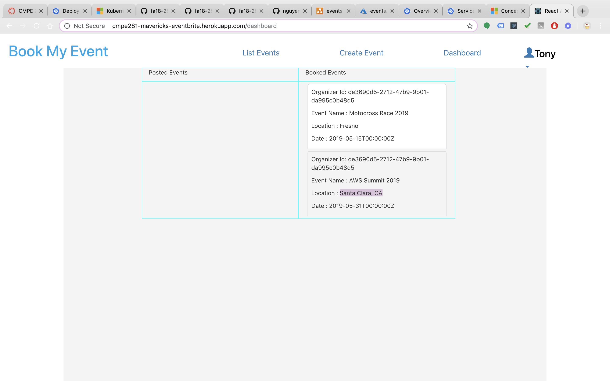

# Team Mavericks
Team project for CMPE-281, Cloud Computing <br>
Submitted To: [Prof Paul Nguyen](https://github.com/paulnguyen)

Team members:
1. [Arihant Sai](https://github.com/Arihant1467)
2. [Pratik Bhandarkar](https://github.com/pratikb25)
3. [Sayali Patil](https://github.com/SayaliPatil)
4. [Sharwari Phadnis](https://github.com/sharwari09)
5. [Thol Chidambaram](https://github.com/thol)

## Key Contributions: :pushpin:
### Pratik Bhandarkar: (Users Microservice, Kong API Gateway)
- Design and deployment of a GO microservices to handle new user signup and user login
- Deployment of MongoDB Shard Clusters for this microservice
- Setup of Kong API gateway to expose all microservices over public network
- Worked in discussing architecture for the BookMyEvent application.
- Worked on finalizing backend databases for the app.

### Arihant Sai: (Dashboard, Lambda Service)
- Researched on how microservice help scale website
- Decided on why RIAK database is important for dashboard
- Implemented AWS lambda services for serverless communication between microservices
- Created serverless dashboard service for high availibility
- Allowed availibility of dashboard service even during the presence of event failures.

### Sharwari Phadnis: (Events Microservice, Microsoft Azure Kubernetes Service)
- Developed Events microservice that creates events on BookMyEvent App.
- Worked on configuring Microsoft Azure Kubernetes Cluster
- Built infrastructure on AKS required for running all microservices. 
- Deployed all the micro-services on Azure Kubernetes Service.
- Worked in discussing architecture for the BookMyEvent application.

### Sayali Patil: (Book Events Microservice, React GUI development)
- Developed frontend of whole application using ReactJs with below features :
User login , Listing already posted events, Registering new event, Booking one of the listed events
- BookEventAPI GO service : 3 endpoints
Booking event, Getting event by userID, Getting event by eventID
- MongoDB sharded cluster for BookEventAPI - x-axis scaling as part of AKF scale cube
- Worked in discussing architecture for the BookMyEvent application.
- Worked on finalizing backend databases for the app.

### Thol Chidambaram: (Dashboard, RIAK Cluster)
- Developed increment user event bookings and user event views as part of user analytics dashboard in golang.
- Implemented riak cluster and developed procedure for testing partiton tolerance in riak.
- Tested the application for partition tolerance.

## Project Architecture Diagram : 


## Description : :information_source:


#### 1. Frontend - User

**Technology Stack:** ReactJs, CSS 

The frontend User Client has been used by a user to log in to the application and the corresponding request will be transfered to corresponding user GO API via Kong API Gateway.

#### 2. Frontend - Event

**Technology Stack:** ReactJs, CSS 

The frontend Event client has been used by a logged in user to register a new event with all the details i.e eventname,date, location, price per ticket etc. in to the application and the corresponding request will be transferred to the corresponding event GO API via Kong Gateway.

#### 3. Frontend - Eventbooking

**Technology Stack:** ReactJs, CSS. 

The frontend EventBooking client has been used by a logged in user to book with all the details i.e eventname, date, location, price per ticket etc. in to the application and the corresponding request will be transferred to the corresponding event GO API via Kong Gateway. 

#### 4. Frontend - Dashboard 

**Technology Stack:** ReactJs, CSS

This page describes the association of the user with the app. It lists out the `Posted Events` and `Booked Events` of the user. 

**Posted Events:** 
- These are the events which are posted by the user. 
- This also provides analytics of the events

**Booked Events:** These are the events which are booked by the user


#### 5. Kong API Gateway

The Kong API Gateway is used to route the frontend request to the External Load Balancer for respective  GO APIS deployed on Azure Kubernetes Service (AKS).

#### 6. Go APIs

i] User API service has below features :
```
 Add a new user
 Delete a user
 Update user details
 Get user by userID
```
 
ii] Event API service has below features :
```
 Register a new event 
 Delete an event 
 Get all events 
 Get an event by eventId
```
 
 iii] EventBooking API service has below features :
 ```
 Book a registered event 
 Get bookings by userID 
 Get bookings by userID 
 ```
 
 iv] Dashboard API service has below features :
 ```
 View Posted Events 
 View Booked Events 
 View Analytics Regarding Posted Events 
 ```
 
 
#### 7. Mongo DB Sharded cluster

- The MongoDb sharded cluster consists of a replica set of 2 config server AWS EC2 instances, 2 shard server instances with 1 node in each shard server and 1 mongos instance as a query router to which respective GO API will send request.

- For the details regarding sharded cluster, refer [BookEventAPI  sharded cluster](https://github.com/nguyensjsu/sp19-281-mavericks/blob/master/bookeventapi/MongoDB_sharding_for_bookeventAPI.md)

#### 8. Riak Cluster

The riak cluster consists of 5 nodes.

# AKF Scale Cube  : :bar_chart:

## X-axis Scaling: 

 - x-axis scaling or Horizontal duplication refers to running multiple identical copies of the application behind a load  
 balancer. 
 - In x-axis scaling, each server runs an identical copy of the service. It has been impleneted with multiple clones  
 of our APIs (i.e pods) behind an External Load Balancer in Azure Kubernetes Serivce (AKS).<br/>
     

## Y-axis Scaling:

 - Y axis scaling refers to functional decomposition of a monolith service i.e. creating microservices. <br/>
 - It has been implemented by separating all the services independently i.e userAPI, eventAPI and bookeventAPI with pods 
 deployed on Azure Kubernetes Service(AKS) <br/>

## Z-axis Scaling:

 - Z axis scaling refers to splitting similar data into different servers.<br/>
 - It has been implemented by using MongoDB sharded cluster with 2 config servers, 2 sharded replica sets and 1 mongos   
 server. MongoDb has been used to store user details, events details and booking details. <br/>

# Microservices Distribution

1. **User signup - (Owner: Pratik Bhandarkar)**<br/><br/>



   - This microservice allows a user to sign up with our app.
   - During sign up a user has to provide his/her email id (which can later be used to login) and a password.
   - The user details and credentials are stored in the MongoDB cluster. A user, on signed up, can book register for an
     event and create his/her own events to be hosted.
     
     
2. **Create Event - (Owner: Sharwari Phadnis)**<br/><br/>

   - This microservice handles creation of events on our app. 
   - The user/organiser has to add details such as name, schedule, venue related to a particular 
     event that they want to host. 
   - The service will contain API implementation of creating events and storing them into the MongoDB cluster.
   
   
3. **Browse Event - (Owner: Thol)**<br/><br/>
   - This microservice handles browsing events for the specific user.
   - User can see following lists
     - Events posted by him
     - Events booked by him
  - This service will have the GET API implementation from MongoDB cluster.
  
  
4. **Book event - (Owner: Sayali)**<br/><br/>

   - This microservice handles booking of an event on our app.
   - The user can choose number of the seats and register for the event.
   - The service will contain API implementation of booking the events and storing them into the MongoDB cluster.
   
   
5. **Dashboard - Arihant ** <br/><br/>


   - This microservice handles the dashboard of the user
   - Here the user will be able to view events posted by him and booked by him and analytics
   - The service will contain API implementation of dashboarding the events and retrieving from RIAK cluster


Steps involved in how to make system fault tolerant during partition
[Network Partition](network-partition.md)


# WOW Factor :sunglasses:

- BookMyEvent is a scalable application and can be deployed conveniently on any Cloud Platform.
- After exploring multiple Kubernetes Platforms we decided to move further with Azure Kubernetes Service.
- Azure Kubernetes Service (AKS) simplifies the deployment and operations of Kubernetes and enables you to dynamically scale your application infrastructure with confidence and agility.
- For our project, we have deployed all our backend micro-services on Azure Kubernetes Service.


**CAP Theorem**

- C : Consistency

A guarantee that every node in a distributed cluster returns the same, most recent, successful write. Consistency refers to every client having the same view of the data

- A : Availibility

Every non-failing node returns a response for all read and write requests in a reasonable amount of time. The key word here is every. To be available, every node on (either side of a network partition) must be able to respond in a reasonable amount of time


- P : Partitioning

he system continues to function and upholds its consistency guarantees in spite of network partitions. Network partitions are a fact of life. Distributed systems guaranteeing partition tolerance can gracefully recover from partitions once the partition heals

It is a widely used concept in distributed system.


# Creativity in the use and application of topics and tools discussed in class

- We have deployed our front end client on Heroku.
- We have used kong as our microservice API gateway.
- All our microservices are deployed as pods using Azure Kubernetes Service. 
- All the microservices pods are running behind external load balancer on AKS achieving x-axis and y-axis as part of AKF scale cube.


## Website :computer:

[http://cmpe281-mavericks-eventbrite.herokuapp.com/](http://cmpe281-mavericks-eventbrite.herokuapp.com/)

## BookMyEvent GUI Workflow

- Logging into the system as an organizer <br>



- Browsing through the list of event that are created <br>


- Creating the event <br>


- Successful response after creating an event <br>


- List gets updated after creating an event <br>


- Update of Posted Events in dashboard <br>


- Signing out <br>


- Logging in as another user who wants to book an event <br>


- Browsing through the list and checking for the event which we posted earlier <br>


- Booking for the event we browsed  <br>


- Successful Booking of event <br>


- Checking the dashboard for the updates  <br>


# Meeting #1
## Week-1 (8 April 2019 to 14 April 2019)
## Discussion Points:

### Ideas: Few project ideas that have been thought and put on the table
    - A door dash kind of system for dry cleaners 
    - An online event-planning site from which you can create an event page, register attendees, and sell tickets online
    - Rental car application to book a car on rent after checking the car details
    - A eCommerce platform like Shopify for online stores and retail point-of-sale systems for selling and marketing
    - A online ticket system like Fandango for reserving seats and booking tickets for Movies, Plays and Shows around the user
    - Home automation along with community monitoring platform (smart communities)
    - Platform for drone management - control and operate drones for agriculture, monitoring and delivery.
    - Finalized Project Idea :
    - An online event-planning site from which you can create an event page, register attendees, and sell tickets online

### Action Items
    - A kanban board has been developed for the project to list various tasks of each member.
    - All the members have been assigned different microservices of the project

### Challenges
    - The API and database schema of the project
    - Listing out services which needs to be leveraged from different cloud providers for the project
    - Developing more scalable application and avoiding the single point of failure
    - Dashboard to monitor the end-to-end status of the system
    - Setup continuous integration and delivery

# Meeting #2 : April 10, 2019
## Discussion Points:
 - Assign microservices tasks to all
 - No need for MySQL, we can use MongoDB for all db needs
 - Load balancer
 - Network or HAProxy?
 - Create sharded MongoDB in a VPC share it with team
 - VPC peering for High Availibility
 - Application components in AKF Scaling
     - X-axis - Data replication
     - Y-axis - Split of service
     - Z-axis - Horizontal data partitioning
 - Redis for browsing the events to improve response time
 - REST API documentation / design per microservice
 - Create Postman REST API collection and share
 - Implementing kong or AWS API gateway
 - discussion regarding wow factor - Amazon EKS service
 - MongoDB: Cluster for storing Users, events, payments information

### Action Items :

 - decided scalable architecture of the application
 - decided how partition will affect nosql system
 
### Challenges :

- Finalizing replication of microservices
- Implementing kubernetes service


# Meeting #3 : April 13, 2019

## Discussion Points:

- Decided global redis for all microservices
- Riak db for dashboard
- List of microservices :

   Users : 	(Pratik) <br/>
      Login
      Signup
      update
   Events :    (Sharwari & Sayali)<br/>
       create event 
       list event
       book event
   Dashboard :  (Arihant & Thol)<br/>
      booked events
      Event and number of views
      No. of events posted
      Number of bookings

- event details :

   Event name 
   Fees
   Location
   Time
   Organizer

### Action Items:

  - Updated the KanBan style task board
  - Completed API development and bug fixes
  - Developed frontend application and integrated it with the backend

### Challenges :

  - CORS issue while connecting GO APIs from frontend
  - Communication between microservices
  - Setting up Microsoft Azure Kubernetes Service Cluster for running all the microservices
  - Setting up lambda server to trigger data into Riak Cluster
  - Testing end to end as the system being distributed
  
  
# Meeting #4 : April 25, 2019

## Discussion Points:

- Decided on how to demonstrate the final BookMyEvent workflow
- Performed end to end integration for the complete application
- Discussed on how to work on the project documentation
  
### Challenges :

- Testing end to end as the system being distributed


## References
- [CAP theorem](https://dzone.com/articles/understanding-the-cap-theorem)
- [Network Partition](https://aphyr.com/posts/281-jepsen-on-the-perils-of-network-partitions)
- [AWS Lambda](https://aws.amazon.com/lambda/)
- [Serverless computation](https://martinfowler.com/articles/serverless.html)
- [Kubernetes](https://www.redhat.com/en/topics/containers/what-is-kubernetes)
- [Azure Kubernetes Service](https://docs.microsoft.com/en-us/azure/)
- [Prof Paul Nguyen](https://github.com/paulnguyen)

